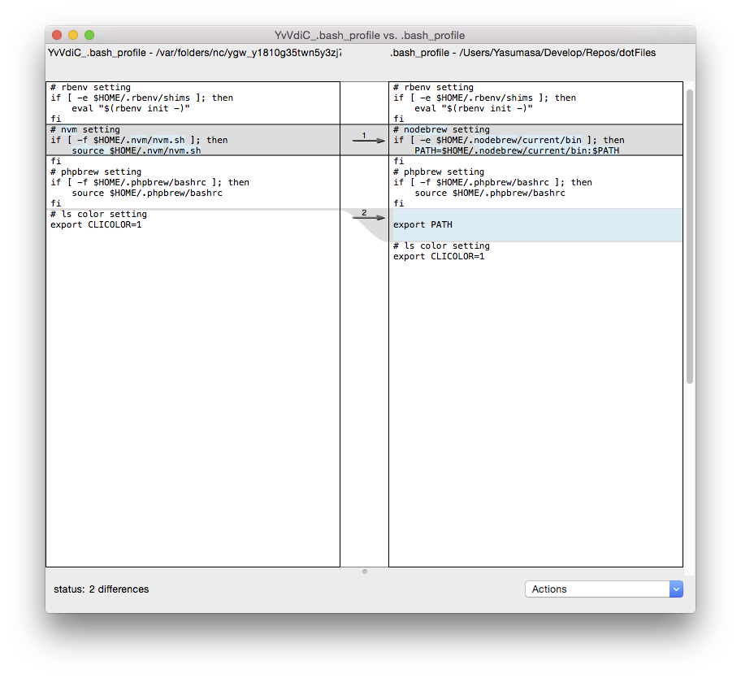
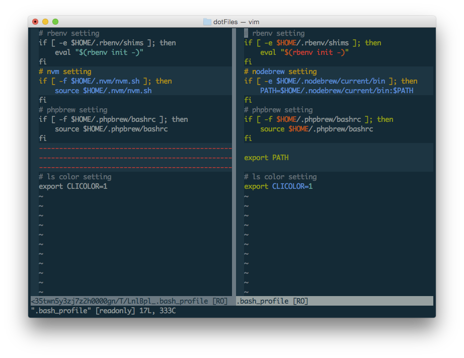

GUIToolの利用
=====================

## GUIToolとは
gitを利用しているとdiffやmergeを行うシチュエーションがある。    
この場合、diffだとCUIベースでの確認となるため、不便である。GUIのdiffやmergeツールを利用することで、作業が容易にできるようになる。

## GUIToolの起動
例えば、diffの場合、```diff```の代わりに```difftool```を指定することでGUIツールを起動できる。   

```
$ git difftool --cached

This message is displayed because 'diff.tool' is not configured.
See 'git difftool --tool-help' or 'git help config' for more details.
'git difftool' will now attempt to use one of the following tools:
opendiff kompare emerge vimdiff

Viewing (1/1): '.bash_profile'
Launch 'opendiff' [Y/n]: 
```


## GUIToolの設定

diff.tool, merge.toolでGUIツールを設定することができる。    
```
$ git config --global --global diff.tool vimdiff2
```

#### 設定の確認
```
$ git config --list
user.name=user_name Nogami
user.email=user_name@hoge.com
diff.tool=vimdiff2
core.repositoryformatversion=0
core.filemode=true
core.bare=false
core.logallrefupdates=true
core.ignorecase=true
core.precomposeunicode=true
remote.origin.url=https://github.com/gyamin/dotFiles.git
remote.origin.fetch=+refs/heads/*:refs/remotes/origin/*
branch.master.remote=origin
branch.master.merge=refs/heads/master
```

#### vimmdiffを起動した場合
```
$ git difftool --cached

Viewing (1/1): '.bash_profile'
Launch 'vimdiff2' [Y/n]: Y
```

